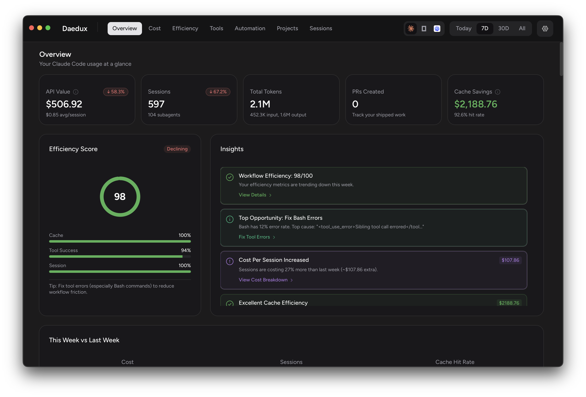

# Daedux

Analytics dashboard for Claude Code usage. Track tokens, costs, and sessions across all your projects.



## Features

- Token and cost tracking across sessions
- Project-based analytics with breakdowns
- Daily, weekly, and monthly trends
- Model usage breakdown (Opus, Sonnet, Haiku)
- Tool usage statistics
- Multi-harness support (Claude Code, Codex, OpenCode)

## Installation

### Desktop App (macOS)

Download the DMG from [GitHub Releases](https://github.com/agentika-labs/daedux/releases):

```
daedux-{version}-darwin-arm64.dmg
```

1. Open the DMG and drag Daedux to Applications
2. On first launch, allow in System Settings > Privacy & Security
3. Daedux runs in the system tray

> **Note:** Currently macOS ARM64 only. Intel support coming soon.

### CLI (via NPM)

```bash
# Global install
npm install -g @agentika/daedux
daedux

# Or via npx (no install)
npx @agentika/daedux

# Or with bun
bunx @agentika/daedux
```

## Prerequisites

- **CLI**: [Bun](https://bun.sh) runtime (automatically used if installed)
- **Desktop**: macOS ARM64 (Apple Silicon)
- **Both**: Claude Code must have been used (`~/.claude/projects/` must exist)

## OpenTelemetry Setup

To receive real-time metrics from Claude Code, configure telemetry export. Choose one approach:

### Option 1: Shell Environment

Add to `~/.zshrc` or `~/.bashrc`:

```bash
export CLAUDE_CODE_ENABLE_TELEMETRY=1
export OTEL_METRICS_EXPORTER=otlp
export OTEL_LOGS_EXPORTER=otlp
export OTEL_EXPORTER_OTLP_PROTOCOL=http/json
export OTEL_EXPORTER_OTLP_ENDPOINT=http://localhost:4318
```

### Option 2: Claude Code Settings

Add to `~/.claude/settings.json`:

```json
{
  "env": {
    "CLAUDE_CODE_ENABLE_TELEMETRY": "1",
    "OTEL_METRICS_EXPORTER": "otlp",
    "OTEL_LOGS_EXPORTER": "otlp",
    "OTEL_EXPORTER_OTLP_PROTOCOL": "http/json",
    "OTEL_EXPORTER_OTLP_ENDPOINT": "http://localhost:4318"
  }
}
```

After configuring, ensure Daedux is running and the OTEL receiver is enabled in Settings.

## CLI Usage

```bash
daedux                      # Start on port 3456, auto-open browser
daedux --port 8080          # Custom port
daedux --no-open            # Don't auto-open browser
daedux --resync             # Full re-parse of all session data
daedux --verbose            # Debug logging

# JSON output mode (no server)
daedux --json               # Output JSON to stdout
daedux --json --filter 7d   # Filter: today, 7d, 30d, all
```

### Options

| Option      | Alias | Description                        | Default |
| ----------- | ----- | ---------------------------------- | ------- |
| `--port`    | `-p`  | Port to run the server on          | 3456    |
| `--json`    | `-j`  | Output JSON to stdout and exit     | false   |
| `--filter`  | `-f`  | Date filter for --json mode        | 7d      |
| `--resync`  | `-r`  | Full resync (clears and re-parses) | false   |
| `--no-open` | `-n`  | Don't open browser automatically   | false   |
| `--verbose` | `-v`  | Enable verbose logging             | false   |

## Data Storage

Database location by platform:

| Platform | Path                                             |
| -------- | ------------------------------------------------ |
| macOS    | `~/Library/Application Support/Daedux/daedux.db` |
| Windows  | `%APPDATA%/Daedux/daedux.db`                     |
| Linux    | `~/.local/share/daedux/daedux.db`                |

## Development

### Commands

```bash
bun install               # Install dependencies
bun run dev               # Full dev (CLI + frontend)
bun run dev:app           # Desktop app with HMR
bun run dev:cli           # CLI server only
bun run dev:frontend      # Vite frontend only
bun run typecheck         # TypeScript check
bun run check             # Lint (ultracite)
bun run fix               # Auto-fix lint issues
bun test                  # Run tests
```

### Architecture

```
src/
├── bun/           # Backend (Bun runtime, Effect TS)
│   ├── analytics/ # Data aggregation services
│   ├── db/        # Drizzle schema + migrations
│   └── services/  # Background services
├── mainview/      # Frontend (React 19, TanStack)
│   ├── routes/    # TanStack Router (file-based)
│   ├── queries/   # TanStack Query definitions
│   └── components/# UI components
├── cli/           # CLI entry point (@effect/cli)
└── shared/        # RPC types (frontend-backend contract)
```

### Building

```bash
bun run build             # Full build (native + frontend + app)
bun run build:prod        # Production build
```

## Tech Stack

- **Runtime**: Bun
- **Backend**: Effect TS, Drizzle ORM, SQLite
- **Frontend**: React 19, TanStack (Query, Router, Table), Tailwind CSS
- **Desktop**: Electrobun

## License

MIT

## Contributing

1. Fork the repository
2. Create a feature branch
3. Run `bun run typecheck` and `bun run check` before committing
4. Submit a pull request

Issues and feature requests: [GitHub Issues](https://github.com/agentika-labs/daedux/issues)
